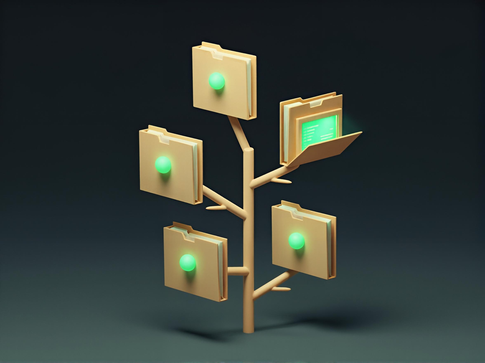

<!--
id: readme
tags: ''
-->

# Repo Peeker (`gitpeek`)



A standalone TempestPHP console application that walks a folder of projects
to a `tree`-style depth limit and shows which directories are git
repositories, along with their branch, dirty/clean state, and ahead/behind
counts.

```
gitpeek status ~/Code -L 2
gitpeek legend
```

## Build

Requires PHP `^8.4` and Composer.

```shell
composer install
vendor/bin/box compile
```

This produces `gitpeek.phar` in the project root — a single file bundling
the application and its production dependencies.

> `box compile` is provided by [`humbug/box`](https://github.com/box-project/box),
> installed via [`bamarni/composer-bin-plugin`](https://github.com/bamarni/composer-bin-plugin)
> into `vendor-bin/box` so its own build-time dependencies never pollute this
> project's dependency graph. A plain `composer install` at the project root
> installs it automatically — use a normal `composer install` here rather
> than `--no-dev`, since `bamarni/composer-bin-plugin` (and therefore `box`
> itself) is a dev dependency; `box compile` handles excluding dev-only
> files from the resulting phar on its own.

## Install

Make the phar executable, drop the `.phar` extension, and move it onto your
`$PATH`:

```shell
chmod +x gitpeek.phar
mv gitpeek.phar ~/bin/gitpeek
```

`gitpeek` now runs standalone from any directory on any machine with a PHP
CLI binary — no `composer install` or project checkout required.

```shell
gitpeek status ~/Code -L 2
gitpeek legend
```

## Usage

- `gitpeek status [path] [-L n]` — colored, tree-style listing of `path`
  (default `.`), capped at `n` levels deep (default `2`).
- `gitpeek status [path] --nested` — also descend into detected repos to
  surface nested repos (submodules, vendored checkouts, etc.).
- `gitpeek status [path] --full` — show the full, uncollapsed filesystem
  tree instead of the default path-collapsed compact view.
- `gitpeek legend` — print the key explaining every symbol/color `status`
  uses.
- `gitpeek status` with no arguments at all is equivalent to `gitpeek status .`.

## Development

```shell
composer install
vendor/bin/phpunit
```

`vendor/bin/phpunit` includes a smoke test (`tests/PharSmokeTest.php`) that
builds `gitpeek.phar` and runs it as a real subprocess to verify the
packaged artifact works end to end.
